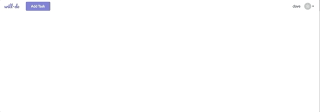

# will-do

basic react-redux todo application
Requires todo-server to be running

The goal is to create a hybrid of google keep and toggl, both tools I've used heavily over the years, and would be nice to marry the two.

TODO:

-   form feedback (errors / success) to utilise toaster's
-   better visualisation for delete / completed tasks (strikethrough)
-   modal form for editing a task
-   implement checklist within task similar to google keep
-   track time against task
